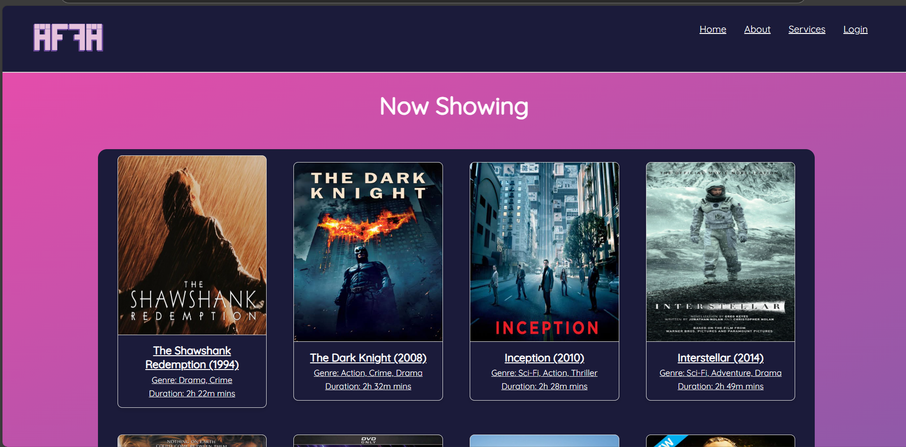
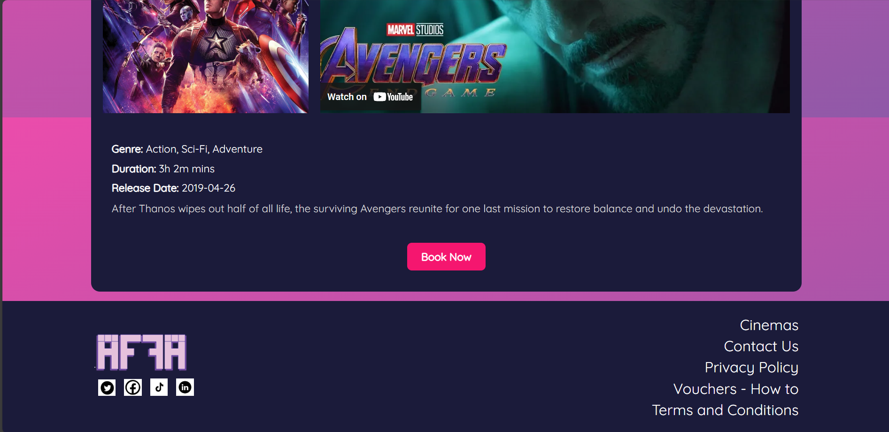
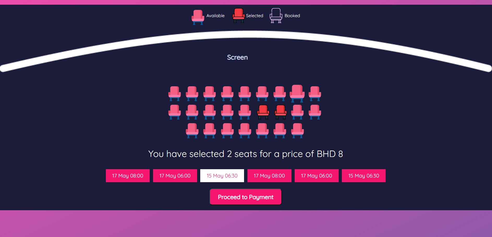
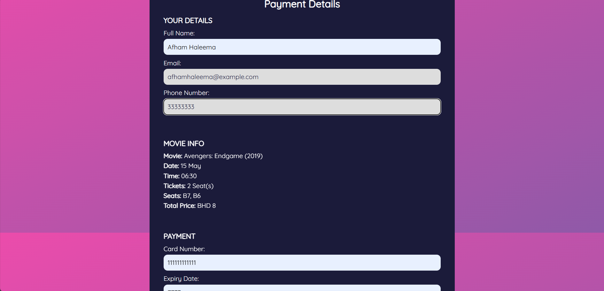
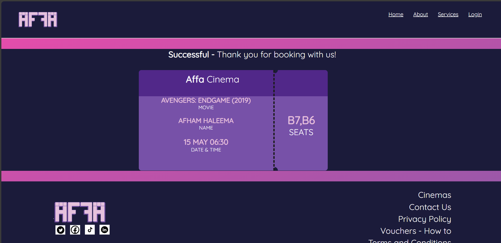

# 🎬 Movie Booking System

A web-based application that allows users to book movie tickets, select showtimes, and choose seats conveniently.

## 📜 Table of Contents

- [Overview](#overview)
- [Features](#features)
- [Screenshots](#screenshots)
- [Technologies Used](#technologies-used)
- [Links](#links)
- [Author](#author)
- [Additional Information](#additional-information)

## 📝 Overview

The Movie Booking System provides a seamless way for users to browse available movies, book tickets for a specific day and time, and select their preferred seating arrangements.

## ✨ Features

- 🎥 View currently available movies
- 🗓️ Select showtimes and dates
- 🎟️ Choose seats and book tickets
- 💳 Secure payment processing
- 📜 Booking confirmation and ticket generation

## 🖼️ Screenshots

## 🛠️ Technologies Used

- **Frontend:** HTML, CSS, JavaScript 
- **Backend:** PHP
- **Database:** MySQL

## 👤 Author  

- **Name:** Afham Haleema  
- **LinkedIn:** [Afham Haleema](https://linkedin.com/in/afhamhaleema)  

## ℹ️ Additional Information  

- This project is built for learning purposes and can be extended with additional features.  
